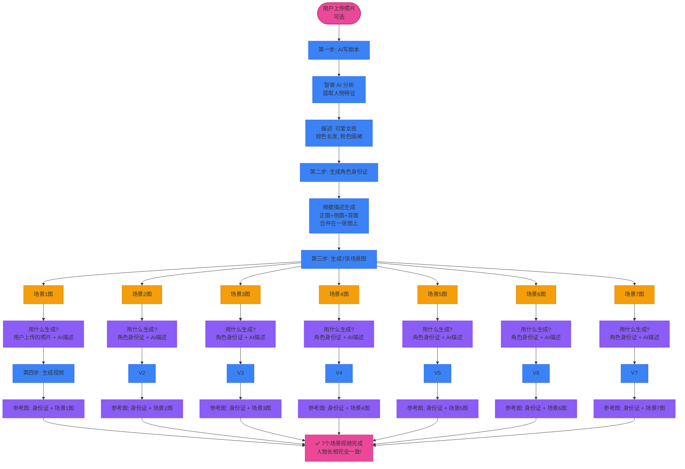
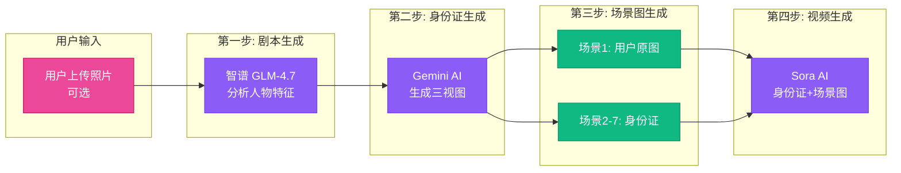

# 人物一致性解决方案

## 🎯 问题：如何让7个场景视频里的"小姐姐"长得一模一样？

---

## 💡 核心方案：一张"角色身份证"

```
┌──────────────────────────────────────────────────┐
│                                                  │
│            角色三视图 = 人物的"身份证"            │
│                                                  │
│   ┌───────────┐    ┌───────────┐    ┌───────────┐│
│   │           │    │           │    │           ││
│   │   正面    │    │   侧面    │    │   背面    ││
│   │   Front   │    │   Side    │    │   Back    ││
│   │           │    │           │    │           ││
│   │  😊       │    │  👃       │    │  🌱       ││
│   │           │    │           │    │           ││
│   └───────────┘    └───────────┘    └───────────┘│
│        ↑               ↑               ↑          │
│     左边            中间            右边          │
│                                                  │
└──────────────────────────────────────────────────┘

这张图片包含：同一个人的 3 个角度
→ AI 看到后，就知道这个人的完整长相了！
```

---

## 📋 完整流程图



---

## 🔍 每一步详解

### 第一步：AI 写剧本

```
你输入: "生成一个小姐姐做草莓蛋糕的视频"
          ↓
智谱 AI 分析:
  - 人物: 可爱女孩，棕色长发，粉色围裙
  - 场景: 厨房
  - 故事: 准备材料 → 混合 → 烘烤 → 装饰 → 品尝
          ↓
输出: 7 个场景的剧本
```

**剧本内容**:
```json
场景1: 女孩走进厨房，系上粉色围裙
场景2: 准备面粉、鸡蛋、草莓
场景3: 混合材料
场景4: 烘烤蛋糕
场景5: 装饰草莓
场景6: 切蛋糕
场景7: 品尝蛋糕
```

---

### 第二步：生成角色身份证

```
剧本中的人物描述
  ↓
"可爱女孩，棕色长发，粉色围裙"
  ↓
AI 生成三视图:
  ┌─────────────────────────────────┐
  │ 正面 │ 侧面 │ 背面 │ (在一张图上)  │
  └─────────────────────────────────┘
  ↓
保存为: character_turnaround.jpg
```

**这就是"角色身份证"！**

```
为什么需要三视图?

正面 → AI 知道脸长什么样
侧面 → AI 知道鼻子、下巴的轮廓
背面 → AI 知道发型、衣服背面

三个角度结合 → AI 完全理解这个人的长相！
```

---

### 第三步：生成 7 张场景图

#### 场景 1 - 特殊处理

```
场景 1: "女孩走进厨房，系上粉色围裙"

输入:
  ✅ 用户上传的照片 (如果有)
  ✅ 角色身份证
  ✅ 场景描述

生成:
  📸 场景1图片.jpg
```

**为什么场景1特殊？**
- 如果用户上传了照片，场景1优先用用户照片
- 这样生成的女孩更像用户想要的样子

#### 场景 2-7 - 标准流程

```
场景 2: "准备面粉、鸡蛋、草莓"

输入:
  ✅ 角色身份证 (正面+侧面+背面)
  ✅ 场景描述

生成:
  📸 场景2图片.jpg
```

**重复这个步骤，生成 7 张场景图**

```
┌─────────┬─────────┬─────────┬─────────┬─────────┬─────────┬─────────┐
│ 场景1图 │ 场景2图 │ 场景3图 │ 场景4图 │ 场景5图 │ 场景6图 │ 场景7图 │
│ 厨房   │ 准备   │ 混合   │ 烘烤   │ 装饰   │ 切蛋糕 │ 品尝   │
└─────────┴─────────┴─────────┴─────────┴─────────┴─────────┴─────────┘

所有图里的女孩，长得一模一样！
因为都用了同一个"角色身份证"
```

---

### 第四步：生成 7 个视频

每个场景图 → 动态视频

```
场景1图 + 角色身份证
  ↓
输入给 AI:
  参考图1: 角色身份证 (正面+侧面+背面)
  参考图2: 场景1图 (女孩在厨房)
  动作描述: "女孩系围裙，微笑"
  ↓
输出:
  🎬 场景1视频.mp4 (5秒)
```

**为什么视频还需要角色身份证？**

```
场景图是静止的
视频是动态的，人物会动、会转头

如果只用场景图:
  人物转头后 → AI 可能画成另一张脸 ❌

有了角色身份证:
  AI 知道正面、侧面、背面都长什么样
  人物怎么动 → 脸都不会变 ✅
```

---

## 🎬 对比：有身份证 vs 没身份证

```
┌─────────────────────────────────────────────────────────┐
│                   没有身份证                            │
├─────────────────────────────────────────────────────────┤
│ 场景1: 棕发女孩                                          │
│ 场景2: 黑发女孩  ← 怎么变黑了？                         │
│ 场景3: 眼睛变大了 ← 好像不是同一个人                    │
│ 场景4: 短发女孩 ← 发型也不对                            │
│                                                         │
│ 结果: 7个场景像7个不同的人在演 ❌                        │
└─────────────────────────────────────────────────────────┘

┌─────────────────────────────────────────────────────────┐
│                   有身份证                              │
├─────────────────────────────────────────────────────────┤
│ 场景1: 棕发女孩                                          │
│ 场景2: 棕发女孩 ← 一样！                                │
│ 场景3: 棕发女孩 ← 还是一样！                            │
│ 场景4: 棕发女孩 ← 全部一样！                            │
│                                                         │
│ 结果: 7个场景是同一个人在演 ✅                           │
└─────────────────────────────────────────────────────────┘
```

---

## 🎯 核心原理：图生图技术

```
什么是"图生图"？

普通生成:
  文字描述 → AI 凭空画一张图

图生图:
  参考图片 + 文字描述 → AI 参考图片的风格和人物画新图

例子:
  参考图: 一个棕色长发女孩的照片
  描述: "这个女孩在厨房系围裙"
  结果: 生成的女孩和参考图里长得一模一样，只是场景变了
```

### 本项目的三种图生图方式

| 方式 | 参考图 | 用在哪个场景 |
|------|--------|-------------|
| **用户原图 → 场景图** | 用户上传的照片 | 场景1 |
| **身份证 → 场景图** | 角色三视图 | 场景2-7 |
| **身份证+场景图 → 视频** | 三视图+场景图 | 所有场景 |

---

## 📊 技术架构



---

## 🎯 关键要点总结

### 用大白话解释

```
1️⃣ 你告诉 AI: "我要一个做蛋糕的视频"
2️⃣ AI 写好剧本，提取人物: "棕色长发女孩，粉色围裙"
3️⃣ AI 生成一张"角色身份证" (正面+侧面+背面)
4️⃣ 用身份证生成7张场景图 (每张图的人长得一样)
5️⃣ 用身份证+场景图生成7个视频 (视频中的人也长得一样)
6️⃣ 合并成完整视频 ✅
```

### 为什么这样有效？

```
身份证 = 人物的"标准照"

每次生成新内容时，AI 都看一眼身份证:
"哦，要画这个女孩啊，我知道她长什么样"

所以不管生成多少场景，永远是同一个人！
```

### 口诀记忆

```
一张身份证，三个角度看
七场图生图，张张都一样
视频再加码，动态也不变
最后合起来，完美短视频
```

---

## 💡 使用建议

| 你做什么 | 效果 |
|---------|------|
| ✅ 上传清晰的正面人物照 | 效果最佳 ⭐⭐⭐⭐⭐ |
| ✅ 照片里的人正面朝向 | 三视图生成更准确 |
| ✅ 照片背景简洁 | AI 更容易提取人物特征 |
| ❌ 不上传照片 | AI 凭想象生成，效果一般 ⭐⭐⭐ |
| ❌ 照片多人或背影 | 可能识别错人物 ⭐⭐ |

---

## 📁 相关文件位置

| 功能 | 文件 |
|------|------|
| 角色身份证数据结构 | `lib/models/character_sheet.dart` |
| 生成角色身份证 | `lib/controllers/screenplay_draft_controller.dart` |
| 用身份证生成场景图 | `lib/controllers/screenplay_controller.dart` |
| 图生图 API | `lib/services/api_service.dart` |
