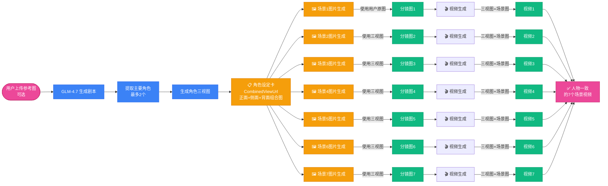
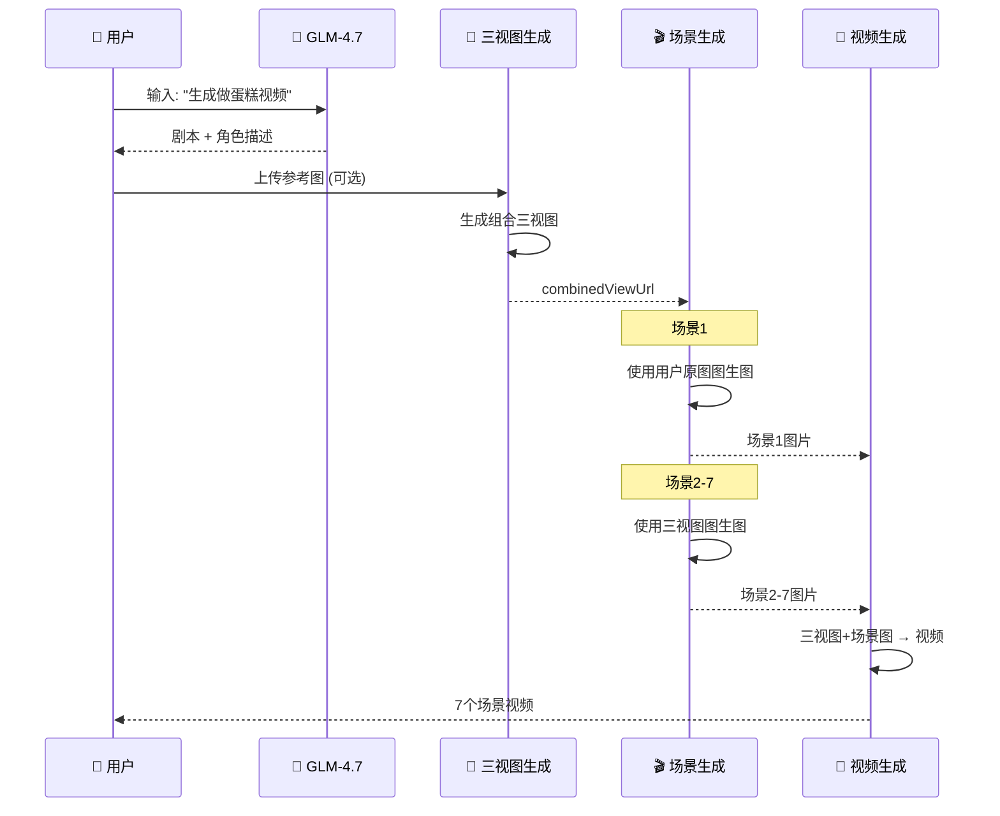

# 人物一致性实现方案详解

## 🎯 目标
确保生成的7个场景视频中的"小姐姐"长得一模一样

---

## 📊 完整流程图



---

## 🔍 核心概念：角色三视图

### 什么是"组合三视图"？

一张图片包含三个视角：
```
┌─────────────────────────────────────────┐
│                                         │
│   ┌─────────┐    ┌─────────┐    ┌─────────┐  │
│   │         │    │         │    │         │  │
│   │  正面   │    │  侧面   │    │  背面   │  │
│   │ Front   │    │  Side   │    │  Back   │  │
│   │         │    │         │    │         │  │
│   └─────────┘    └─────────┘    └─────────┘  │
│      LEFT          CENTER          RIGHT     │
│                                         │
└─────────────────────────────────────────┘
```

**为什么这样设计？**
- ✅ 一张图包含三个角度，确保 AI 学习完整的人物特征
- ✅ 后续图生图时，AI 能理解人物的多角度外观
- ✅ 比生成三张独立图片更高效

### 数据模型

```dart
class CharacterSheet {
  final String characterId;      // 角色ID: "char_001"
  final String characterName;     // 角色名称: "草莓女孩"
  final String description;       // 角色描述

  // 核心字段：组合三视图 URL
  String? combinedViewUrl;        // "https://cdn.example.com/turnaround_001.jpg"

  // 旧版字段（已废弃，保留兼容）
  @Deprecated('使用 combinedViewUrl 替代')
  String? frontViewUrl;
  @Deprecated('使用 combinedViewUrl 替代')
  String? sideViewUrl;
  @Deprecated('使用 combinedViewUrl 替代')
  String? backViewUrl;
}
```

---

## 📝 详细步骤

### 步骤 1️⃣: 剧本生成

**用户输入**:
```
生成一个小姐姐做草莓蛋糕的视频
```

**GLM-4.7 AI 返回的剧本**:
```json
{
  "scenes": [
    {
      "scene_id": 1,
      "narration": "走进厨房，准备做蛋糕",
      "character_description": "一位可爱的年轻女性，约20岁，有着柔顺的棕色长发，明亮的眼睛，穿着粉色围裙"
    }
  ]
}
```

**关键**: `character_description` 字段包含人物特征描述

---

### 步骤 2️⃣: 提取主要角色

**代码逻辑**:
```dart
// lib/controllers/screenplay_draft_controller.dart:328-422
List<Map<String, String>> _extractMainCharacters(ScreenplayDraft draft) {
  // 1. 获取第一个场景的角色描述
  String? characterDesc = draft.scenes.first.characterDescription;

  // 2. 智能分割多个角色（按句号、分号）
  final characters = characterDesc.split(/\.|;/);

  // 3. 最多提取2个角色
  return characters.take(2).map((desc) => {
    'name': '角色${index + 1}',
    'description': desc,
    'role': index == 0 ? '主角' : '第二主角',
  }).toList();
}
```

**输出**:
```dart
[
  {
    'name': '草莓女孩',
    'description': '一位可爱的年轻女性，约20岁，有着柔顺的棕色长发，明亮的眼睛，穿着粉色围裙',
    'role': '主角'
  }
]
```

---

### 步骤 3️⃣: 生成角色三视图

**提示词构建**:
```dart
// lib/services/api_service.dart:1830-1851
String _buildCombinedViewPrompt(String characterDesc) {
  return '''
Character turnaround sheet with three views of the same character arranged horizontally:
- LEFT: Front view
- CENTER: Side view (profile)
- RIGHT: Back view

Character: $characterDesc

Style: Clean anime style, consistent lighting, white background, high quality.
Ensure the character's face, hair, and outfit are clearly visible in all three views.
''';
}
```

**API 调用**:
```dart
// 使用用户上传的原图作为参考
final imageUrl = await generateImage(
  prompt: combinedViewPrompt,
  referenceImages: userUploadedImage,  // 图生图
);
```

**返回结果**:
```dart
CharacterSheet {
  characterId: "char_001",
  characterName: "草莓女孩",
  combinedViewUrl: "https://cdn.example.com/turnaround_char_001.jpg",
  status: completed
}
```

---

### 步骤 4️⃣: 场景图片生成

#### 场景 1：使用用户原图

**策略**: 如果用户上传了参考图，场景1优先使用用户原图

```dart
// lib/controllers/screenplay_controller.dart
if (sceneIndex == 0 && userOriginalImages != null) {
  // 场景1：使用用户原图进行图生图
  imageUrl = await _apiService.generateImage(
    scene.imagePrompt,
    referenceImages: userOriginalImages,  // 用户上传的原图
  );
}
```

**请求格式**:
```json
{
  "model": "gemini-2.5-flash-image-vip",
  "prompt": "A cute girl in modern kitchen, tying pink apron, warm lighting",
  "image": "https://user-upload.example.com/reference.jpg"
}
```

#### 场景 2-7：使用角色三视图

**策略**: 后续场景使用角色三视图保持一致性

```dart
// lib/controllers/screenplay_controller.dart
if (sceneIndex > 0 && characterReferenceUrls != null) {
  // 场景2+：使用角色三视图进行图生图
  imageUrl = await _apiService.generateImageWithCharacterReference(
    scene.imagePrompt,
    characterImageUrls: characterReferenceUrls,  // [combinedViewUrl]
  );
}
```

**请求格式** (Chat API):
```json
{
  "model": "gpt-4o-image-vip",
  "messages": [
    {
      "role": "user",
      "content": [
        {
          "type": "text",
          "text": "Girl mixing flour in a bowl, kitchen scene"
        },
        {
          "type": "image_url",
          "image_url": {
            "url": "https://cdn.example.com/turnaround_char_001.jpg"
          }
        }
      ]
    }
  ]
}
```

**为什么这样有效？**
- AI 看到了角色的正面、侧面、背面三个视角
- 理解了人物的多角度外观
- 生成新场景时会自动保持人物特征

---

### 步骤 5️⃣: 场景视频生成

**参考图组合策略**:

```
角色三视图 (最多2张) + 当前场景图 (1张) = 最多3张参考图
```

**代码实现**:
```dart
// lib/controllers/screenplay_controller.dart:274-297
// 构建参考图列表
final List<String> referenceUrls = [];

// 1. 添加角色三视图（支持双主角）
referenceUrls.addAll(characterUrls);  // 最多2张

// 2. 添加当前场景的分镜图
if (imageUrl != null) {
  referenceUrls.add(imageUrl);  // 1张
}

// 总计：最多3张参考图
AppLogger.info('视频生成', '场景 $sceneNum 参考图: ${referenceUrls.length} 张');

final videoResponse = await _apiService.generateVideo(
  imageUrls: referenceUrls,  // [三视图, 场景图]
  prompt: scene.videoPrompt,
  seconds: '5',
  model: 'veo3.1-components',  // 支持多图参考的模型
);
```

**API 请求**:
```http
POST /v1/videos
Content-Type: multipart/form-data

model=veo3.1-components
prompt=Girl whisking eggs, dynamic camera movement, flour dusting effect
seconds=5
size=1280x720
input_reference=https://cdn.example.com/turnaround_char_001.jpg
input_reference=https://cdn.example.com/scene_1.jpg
```

**veo3.1-components 模型特点**:
- ✅ 支持多张图片作为参考（最多3张）
- ✅ 能综合所有参考图的人物特征
- ✅ 生成视频时保持人物外观一致

---

## 🎬 双主角支持

当剧本中有2个主要角色时：

```dart
// 角色1：草莓女孩
CharacterSheet {
  characterId: "char_001",
  combinedViewUrl: "https://cdn.example.com/turnaround_001.jpg"
}

// 角色2：助手小明
CharacterSheet {
  characterId: "char_002",
  combinedViewUrl: "https://cdn.example.com/turnaround_002.jpg"
}
```

**视频生成时的参考图**:
```dart
referenceUrls = [
  "https://cdn.example.com/turnaround_001.jpg",  // 角色1三视图
  "https://cdn.example.com/turnaround_002.jpg",  // 角色2三视图
  "https://cdn.example.com/scene_5.jpg"          // 当前场景图
]
// 共3张，达到上限
```

---

## 🔄 降级策略

当没有用户上传图片时，如何保证一致性？

```dart
// lib/controllers/screenplay_controller.dart
Future<String> generateSceneImage(Scene scene, int sceneIndex) async {
  // 策略1: 有用户原图 -> 使用原图（场景1）
  if (sceneIndex == 0 && _userOriginalImages != null) {
    return await _apiService.generateImage(
      scene.imagePrompt,
      referenceImages: _userOriginalImages,
    );
  }

  // 策略2: 有角色三视图 -> 使用三视图（场景2+）
  if (_characterReferenceUrls != null && _characterReferenceUrls!.isNotEmpty) {
    return await _apiService.generateImageWithCharacterReference(
      scene.imagePrompt,
      characterImageUrls: _characterReferenceUrls!,
    );
  }

  // 策略3: 无参考图 -> 纯文本生成（降级）
  return await _apiService.generateImage(scene.imagePrompt);
}
```

**降级后果**:
- ❌ 场景之间的人物可能不一致
- ⚠️ 仅依赖 prompt 中的文字描述
- 💡 建议：用户上传参考图以获得最佳效果

---

## 📊 数据流图



---

## 🔧 技术要点

### 1. Chat API vs 生成 API

| API | 用途 | 特点 |
|-----|------|------|
| `gemini-2.5-flash-image-vip` | 简单图生图 | 单张参考图 |
| `gpt-4o-image-vip` (Chat) | 多模态图生图 | 支持多张参考图 |

**为什么场景2+使用 Chat API？**
- ✅ 可传入多个图片 URL
- ✅ content 数组格式：`[{type: "text"}, {type: "image_url"}]`
- ✅ 更适合角色参考场景

### 2. 多图参考模型

| 模型 | 支持图片数 | 用途 |
|-----|-----------|------|
| `veo3.1` | 1张 | 简单图生视频 |
| `veo3.1-components` | 最多3张 | 多图参考（推荐） |
| `sora-1` | 1张 | OpenAI Sora |

**项目选择**: `veo3.1-components`
- 支持 `input_reference` 字段重复传值
- 可同时接收角色三视图 + 场景图

### 3. 请求格式对比

**图片生成 (场景1)**:
```json
{
  "model": "gemini-2.5-flash-image-vip",
  "prompt": "...",
  "image": "https://url"
}
```

**图片生成 (场景2+)**:
```json
{
  "model": "gpt-4o-image-vip",
  "messages": [{
    "role": "user",
    "content": [
      {"type": "text", "text": "..."},
      {"type": "image_url", "image_url": {"url": "..."}}
    ]
  }]
}
```

**视频生成**:
```http
POST /v1/videos
input_reference=https://url1
input_reference=https://url2
input_reference=https://url3
```

---

## 📁 关键代码位置

| 功能 | 文件路径 | 关键方法/行号 |
|------|---------|--------------|
| 角色模型 | `lib/models/character_sheet.dart` | CharacterSheet |
| 提取角色 | `lib/controllers/screenplay_draft_controller.dart` | `_extractMainCharacters():328` |
| 生成三视图 | `lib/controllers/screenplay_draft_controller.dart` | `generateCharacterSheets():290` |
| 构建提示词 | `lib/services/api_service.dart` | `_buildCombinedViewPrompt():1830` |
| 图生图(多图) | `lib/services/api_service.dart` | `generateImageWithCharacterReference():1580` |
| 场景生成 | `lib/controllers/screenplay_controller.dart` | `generateFromConfirmed():136` |
| 视频生成 | `lib/services/api_service.dart` | `generateVideo():1966` |

---

## 💡 总结

### 人物一致性 = 三层保障

1. **角色三视图** 🔑
   - 一张图包含正面、侧面、背面
   - AI 学习完整的人物多角度特征

2. **场景图片** 🖼️
   - 场景1: 用户原图 → 图生图
   - 场景2+: 三视图 → 图生图

3. **场景视频** 🎬
   - 参考图: 三视图(2张) + 场景图(1张)
   - 使用 veo3.1-components 模型

### 最佳实践

| 操作 | 效果 |
|------|------|
| ✅ 上传清晰的正面人物照 | 人物一致性最佳 |
| ✅ 参考图中人物正面朝向 | 三视图生成效果更好 |
| ❌ 不上传参考图 | 降级为纯文本，一致性无法保证 |
| ❌ 参考图多人或背影 | AI 可能混淆角色特征 |

### 流程口诀

```
用户传图生三图，
场景一用原图输，
场景二到七用图，
视频三图保一致。
```
