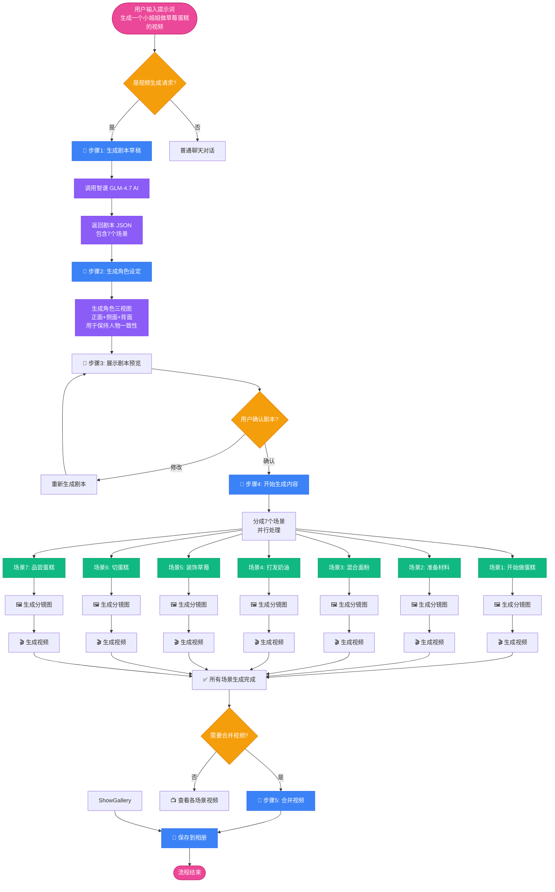
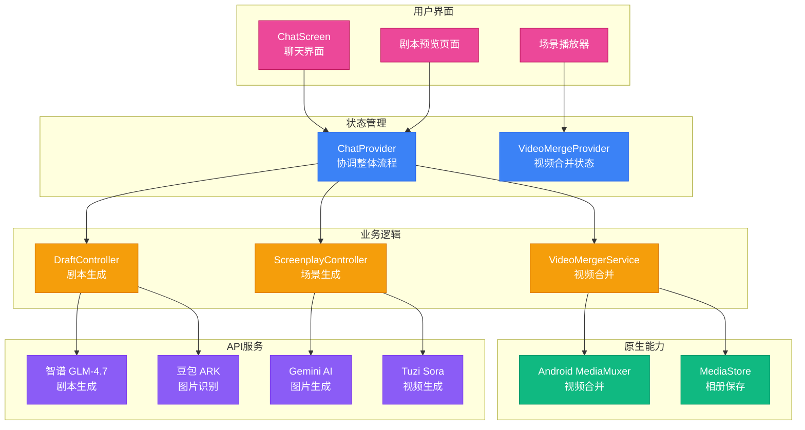
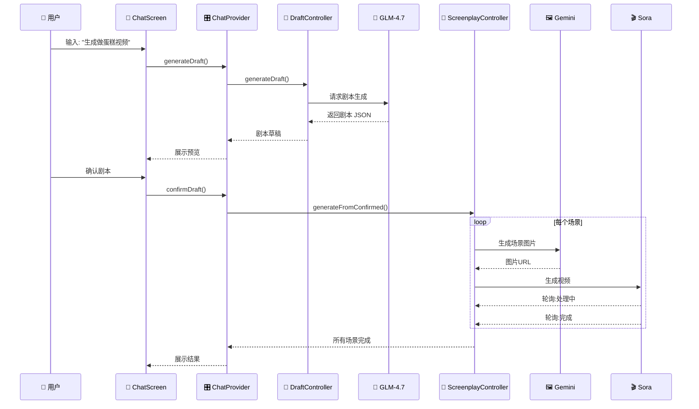

# AI Director 视频生成完整流程

> 当你输入"生成一个小姐姐做草莓蛋糕的视频"时，系统是如何工作的？

## 📋 流程图说明



---

## 🔍 详细步骤说明

### 步骤 1️⃣: 生成剧本草稿
**AI 思考**: "用户想要一个关于做蛋糕的视频，我需要设计一个完整的故事"

| 操作 | 说明 |
|------|------|
| 输入 | "生成一个小姐姐做草莓蛋糕的视频" |
| 调用 | 智谱 GLM-4.7 AI |
| 输出 | 7个场景的剧本，每个场景包含：<br>- 中文旁白<br>- 情绪描述<br>- 图片生成提示词<br>- 视频动效提示词 |

**剧本示例**:
```json
{
  "title": "草莓蛋糕制作",
  "scenes": [
    {
      "scene_id": 1,
      "narration": "今天要做美味的草莓蛋糕",
      "image_prompt": "A cute girl in kitchen, preparing to make strawberry cake",
      "video_prompt": "Girl tying apron, smiling at camera"
    },
    // ... 更多场景
  ]
}
```

---

### 步骤 2️⃣: 生成角色设定
**目标**: 确保所有场景中的"小姐姐"长得一样

| 操作 | 说明 |
|------|------|
| 技术方案 | 生成一张"角色三视图"图片<br/>（正面 + 侧面 + 背面） |
| 作用 | 后续所有场景都用这张图做参考<br/>实现"图生图"保持人物一致 |

```
┌─────────────────────────────────────┐
│     角色三视图参考图                 │
│  ┌──────┐  ┌──────┐  ┌──────┐      │
│  │ 正面 │  │ 侧面 │  │ 背面 │      │
│  │      │  │      │  │      │      │
│  └──────┘  └──────┘  └──────┘      │
└─────────────────────────────────────┘
```

---

### 步骤 3️⃣: 展示剧本预览
**用户可以**:
- ✅ 确认剧本，开始生成
- ✏️ 修改某些场景
- 🔄 重新生成整个剧本

---

### 步骤 4️⃣: 开始生成内容

#### 4.1 生成分镜图
每个场景独立生成图片：

| 场景 | 图片内容 | 技术说明 |
|------|----------|----------|
| 场景1 | 小姐姐走进厨房，系上围裙 | 使用角色三视图做参考 |
| 场景2 | 准备面粉、鸡蛋、草莓 | 使用角色三视图做参考 |
| 场景3 | 混合材料，搅拌均匀 | 使用角色三视图做参考 |
| 场景4 | 打发奶油 | 使用角色三视图做参考 |
| 场景5 | 装饰草莓 | 使用角色三视图做参考 |
| 场景6 | 切开蛋糕 | 使用角色三视图做参考 |
| 场景7 | 品尝蛋糕，露出满意的笑容 | 使用角色三视图做参考 |

**并发处理**: 同时生成2个场景的图片，提高速度

#### 4.2 生成视频
将每张分镜图变成动态视频：

| 操作 | 说明 |
|------|------|
| 输入 | 分镜图 + 视频动效提示词 |
| 调用 | Tuzi Sora AI 视频生成 |
| 时长 | 每个视频约5秒 |
| 等待 | 轮询查询生成状态（约1-2分钟） |

**视频生成参考图**:
- 角色三视图（保持人物一致）
- 当前场景的分镜图
- 最多支持3张参考图

---

### 步骤 5️⃣: 合并视频（可选）
**技术方案**: Android 原生方法使用 Mp4Parser

```
场景1视频 (5秒) ──┐
场景2视频 (5秒) ──┤
场景3视频 (5秒) ──┤
场景4视频 (5秒) ──┼──► [无损合并] ──► 完整视频 (35秒)
场景5视频 (5秒) ──┤
场景6视频 (5秒) ──┤
场景7视频 (5秒) ──┘
```

**特点**:
- ✅ 无损合并，不重新编码
- ✅ 保持原始画质
- ✅ 完美衔接各场景

---

### 保存到相册
合并后的视频保存到手机的 `Movies/Movies` 文件夹

---

## 🎬 技术架构图



---

## 🔄 数据流转



---

## 📊 关键数据模型

### 剧本 (Screenplay)
```dart
{
  "taskId": "唯一ID",
  "scriptTitle": "草莓蛋糕制作",
  "status": "completed",
  "scenes": [
    {
      "sceneId": 1,
      "narration": "今天要做美味的草莓蛋糕",
      "imageUrl": "https://...",
      "videoUrl": "https://...",
      "status": "completed"
    }
  ]
}
```

### 角色设定 (CharacterSheet)
```dart
{
  "characterId": "char_001",
  "characterName": "草莓女孩",
  "combinedViewUrl": "https://...", // 三视图图片
  "referenceImageUrl": "https://..." // 用于图生图
}
```

---

## ⚙️ 配置说明

| 配置项 | 默认值 | 说明 |
|--------|--------|------|
| 场景数量 | 7 | 每个剧本包含的场景数 |
| 并发生成数 | 2 | 同时生成的场景数量 |
| 视频时长 | 5秒 | 每个场景视频的时长 |
| 轮询超时 | 10分钟 | 视频生成最长等待时间 |

---

## 🎯 总结

整个流程就像一个**数字化的电影制作团队**：

1. **编剧** (GLM-4.7): 编写剧本
2. **美术设计** (Gemini): 设计分镜图
3. **摄影师** (Sora): 拍摄视频片段
4. **剪辑师** (MediaMuxer): 合成完整视频
5. **发行商** (MediaStore): 保存到相册

你只需要一句话，AI 就能完成从创意到成片的全部工作！🎬
